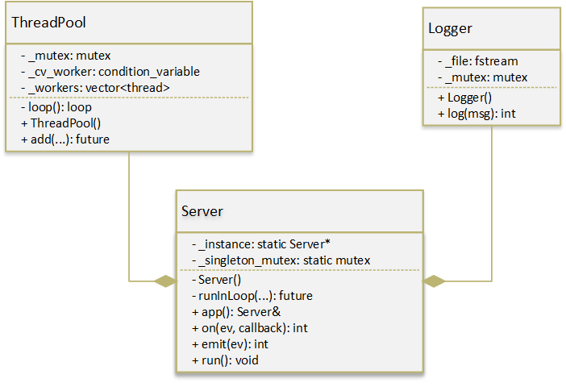
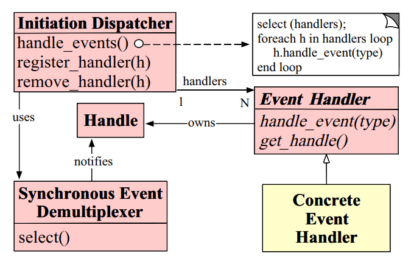
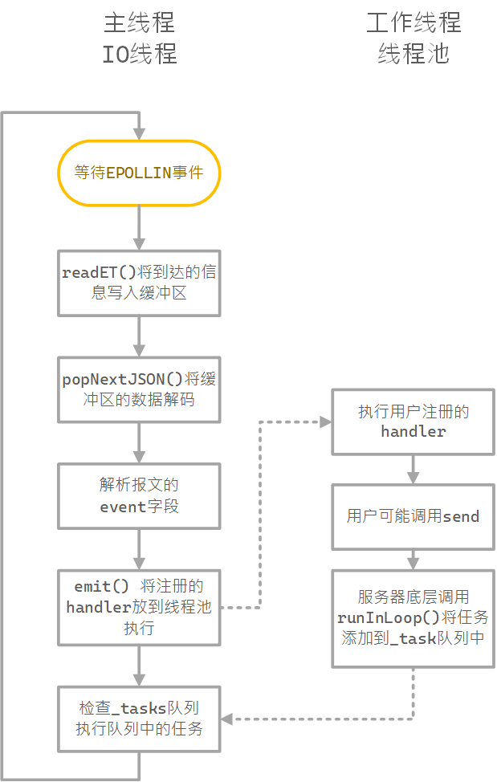
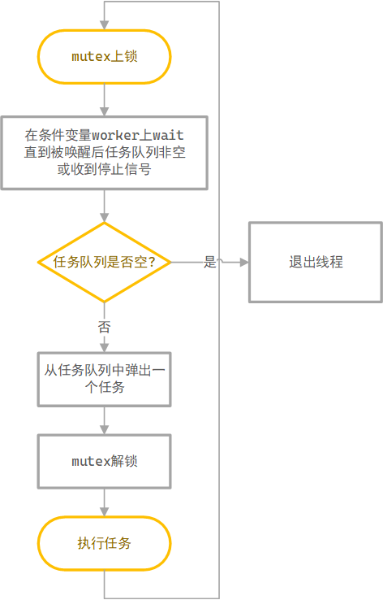

# Simple TCP Server

[TOC]

## Introduction

* Using reactor-model. One event loop thread(I/O thread), and a pool for workers threads.
* Based on event model.  You can register an event handler like node.js.
* Handlers are somehow asynchronized. They will run in other thread independent with I/O thread.
* Use a simple protocol based on TCP.
  ```c
  + - - - - + - - - - - - - + 
  |   len   | json sequence |
  + - - - - + - - - - - - - +
  uint32_t        len; 		 
  json            sequence;	 
  ```
* A simple thread pool based on `std::future`, partially referenced to [progschj](https://github.com/progschj/ThreadPool).
* A simple but thread-safe logger.
## Dependency         
* C++14+ support.
* [nlohmann/json](https://github.com/nlohmann/json) 
## Server Examples
Include our `Server.h` and Nlohmann's `json.hpp`.
```c
#include<Server.h>
#include<json.hpp>
```
A simple C/S echo server.
```c
int main(){
    Server::app().on("hello", [](auto data, int fd){
        data["reply"] = "Hi";
        Server::app().syncSend(data, fd);
    });
    Server::app().run(8888, "127.0.0.1");
}
```
Here's the beautiful output by our Logger.

```text
Wed Dec  2 21:48:14 2020    server 0.0.0.0:8888 start successfully
```

> However, controller can only registered by `app().on()` currently. The controller class will be added soon.

Besides normal synchronized `syncSend`. We also provide `asyncSend`. 
1. Promise-Future Version
```c++
void worker() {
    //...
    auto fu = Server::app().asyncSend("data", data);
    //prepare other data
    fu.get();
    Server::app().asyncSend("data", data2);
    //...
}
```
2. Callback Version
```c++
void worker() {
    Server::app().asyncSend("data", data, fd, [](int ret){
        Server::app().logStr("data successfully sended.");
    });
}
```
## Thread pool Examples

```c
ThreadPool t(10);
auto fu = t.add([](int a, int b) { return a + b; }, 1, 2);
std::cout << fu.get() << std::endl;
```

## Logger Examples

```c
auto logger = new Logger;
Logger.setFile("server.log", true);
Logger.log("hello world");
```

The logger has well formatted output with a timestamp.

```text
Wed Dec  2 21:48:14 2020    hello world
```

## Server Integrated Events

|event |description |
|:--: | :--:|
| `server-ok` | Server is about to enter the event loop. |
| `fd-out` | A connection closed.  |
| `fd-in` | A new connection established. |

## 实现细节

### 模块化

* `Threadpool` 类，一个独立的线程池类。
* `Logger` 类， 一个独立的线程安全的日志类。
* `Server`类，使用以上两个类实现的独立的并发服务器框架。采用linux下的`epoll`系统调用实现并发处理，使用线程池实现业务线程与IO线程的分离，并成功实现了业务逻辑(controller)的解耦合。

这个库的设计经过重重调整，现在处处体现着高耦合低内聚的设计思想。



> 上图仅挑重点属性进行显示，详细介绍请看对应头文件中的注释。

### 设计模式

1. 单例模式

   * Server类被设计成单例模式，使用app() 返回该类的引用(即单例)。使用单例模式是基于我们采用的IO模型，主线程内只有一个`epoll_wait()`来监听所有连接的可读事件。不使用static的原因是该类里面包括一些成员变量，当不需要使用该类的时候，该类不会被实例化，因此也就不会浪费空间。

   * 单例模式关键部分使用双重判断+锁实现，在保证单例的同时保持性能，避免每次调用都要获取锁，实现如下：

     ```c++
     Server &Server::app() {
         if (_instance == nullptr) {
             std::unique_lock<std::mutex> lck(_singleton_mutex);
             if (_instance == nullptr) { _instance = new Server; }
         }
         return *_instance;
     }
     ```

2. reactor模式

   * reactor模式来自 *An Object Behavioral Pattern for Demultiplexing and Dispatching Handles for Synchronous Events* 这篇论文，是一个基于事件机制的设计模式，被广泛用于用于处理网络并发，论文中对于该设计模式的定义如下。


     
* 从面向对象的角度上来说，主要有三个类，`Demultiplexer` `Dispatcher` `Handler`，我们在权衡了时间，效率，可用性，性能等方面后，决定首先使用如下的方法实现：
  
     * Demultiplexer：使用linux的epoll系统调用进行IO多路复用，监听事件的到达。
     * Dispatcher就是我们的Server类，`app().on`方法对应`register_handler()`，用于注册一个事件对应的handler。`app().run()`对应`handle_events()`方法，在后文中也称为事件循环。
  * Event Handler就是用户自定义的业务逻辑处理函数。函数的句柄`handle`在服务器里面对应socket描述符fd。该Handler体现为`app().on`方法注册的回调函数。
  
     > 以上实现着重参考了如下语言/框架：
     >
     > * Java Spring MVC: 使用注解的方式标记controller类，C++无法做到。
     >
     > * Node.js: 全异步，提供app().on("request", callback) 的方法处理注册业务逻辑并执行回调函数。在ES6的async-await语法出现前很容易陷入回调地狱。使用回调函数注册handler的方式简洁，非常适合小型项目，且C++11的std::function类为回调的实现提供了强大的支持，因而我们首先考虑实现app().on()的API。且考虑到node.js的教训，我们为的send函数同时提供了同步，异步+future（类似async-await），异步+回调三个版本。
     >
     >   对比`nodejs`的`express.js`模块如下：(http)
     >
     >   ```js
     >   app.get('/hello', (req, res)=>{
     >     res.send('Hello World');
     >   });
     >   ```
     >
     >   我们的服务器如下:
     >
     >   ```c++
     >   Server::app().on("hello",[](auto data, int fd) {
     >   	Server::app().syncSend("hello world", fd);
     >   });
     >   ```
     >
     >   现在由于没封装`Connection`类.因而`send`函数还没有提供面向对象的方法。
     >
     > * C++: drogon：同时提供了通过回调函数注册事件和通过类注册事件的版本，采用了一些高级的预编译技巧来实现。

### 并发模型

* 基于reactor模式衍生出的并发模型很多，综合考量后我们选择了 one reactor  + thread pool 模型。主线程和工作线程分工如下：
  

  > 采用该模型主要参考对比了如下框架：
  >
  > * moduo: one loop per thread。将并发的fd分配到多个线程中监听，而不是在同一个线程监听，每个线程中都有事件循环。这样的实现较为复杂，且涉及到负载均衡问题，因而我们考虑只设计一个事件循环线程。
  > * nginx：多进程。多进程在共享数据上非常困难，因而我们只考虑多线程的方式。

* 在上面的流程图中，工作线程和IO线程分离，工作线程的执行不会阻塞网络IO，从而实现高并发。

* 我们的框架将会为用户封装许多IO操作的接口(暂时只封装了`send`，还会封装关闭socket连接等接口)，由于跨线程操作socket是一个非常不明智的选择，因此参考moduo的实现我们设计了一个`runInLoop()`函数，该函数可以将任务添加IO线程的`_tasks`队列中，等待主线程每轮事件循环结束的时候将它拿出来执行。用户希望向一个socket发送消息的时候智能调用我们提供的`asyncSend()`和`syncSend`接口，该接口会调用`runInLoop()`将一个发送数据的任务挂在`_tasks`队列上。

* `runInLoop()`的存在简化了多线程操作IO的逻辑，主线程除了`_tasks`队列以外的所有成员变量都不需要加锁。

### 服务器类设计

* 每个连接都有一个自己的缓冲区。
* 使用`writeET()`和`readET()`来实现非阻塞socket的收发。
* `_tasks`任务队列用`_task_mutex`来保护。
* `popNextJSON()`函数用于从缓冲区中弹出一个完整报文。
* `on()`用于注册事件。
* `emit()`用于发送信号，触发事件。
* `run()`用于启动服务器。
* `asyncSend()`和`syncSend()`用于在工作线程中向socket发送信息。

### 其他

#### 线程池实现

* 工作线程流程图：
  
* `add(...)`实现
  * 使用`template` 和`decltype`来实现符合直觉的调用接口。
  * 使用`lambda`函数实现向任务队列中添加不同类型的函数。
  * 使用`std::future`给用户提供获取返回值的服务。

#### 日志管理器实现

* 简单地使用一个锁维护线程安全。


## 困难
* 需要c++14主要是线程池使用了decltype(auto),如果希望C++11的话可以自己去改回来。
* IO线程 oneloop per thread，只不过我现在还只有一个io线程。
* 好的 现在开始变成异步 ET
    * epoll只监听可读信息,检测到可读后会将所有信息读入缓冲区。
    * 所有写计划不注册EPOLLOUT,而是通过runInLoop在每轮epoll结束后执行,
        * 这是一种简单的且不对效率产生较大影响的跨线程write的实现方式。
        * 提供syncSend和asyncSend两个接口供业务线程各取所需。
    * 安全性需要得到保障, 所有业务线程中对socket的操作都必须仅通过runInLoop函数调用。
    * 在没有计时器等机制的情况下, runInLoop对函数无任何限制,因而使用的时候应非常小心。
    * 很多时候用户希望使用fd构造自己的逻辑,最简单的情形就是需要在socket关闭时设置用户状态。暂时没有实现。
        * 提供fd-out fd-in事件实现
* fd不应轻易暴露出来, 以避免程序员直接跨线程对socket进行可怕的操作。
    * Connection类将会用来封装fd。
    * 没有Connection类最大的问题在于,fd不能用于标识一个连接。
        * 主线程关闭了fd, 但是runInLoop里面的任务对该fd继续进行操作会出错。
            * 即便如此, 我们还是暂时采取了这样的策略: 
            * 在实现里只有主线程调用delClientFd()函数,在API上业务线程无法调用删除fd的接口。
        * Connection要实现很多绑定问题。
* controller类等了好久了怎么还没更(狗头)。应当提供Controller类,使得业务逻辑也可以成为独立的组件。
* 添加异常机制.
* 如何优雅地关闭socket, 使得所有挂在runInLoop上的和他相关的任务都不要再执行。
    * 应该把connection作为挂在runInLoop上面的任务的一个属性。
